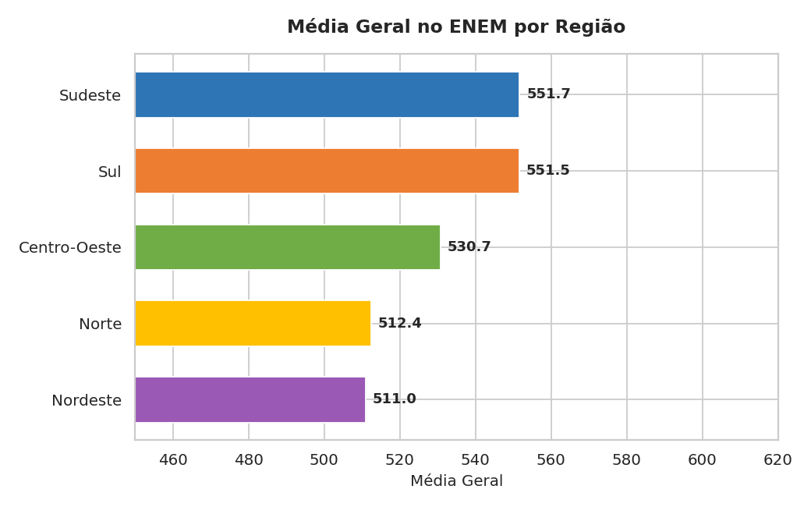
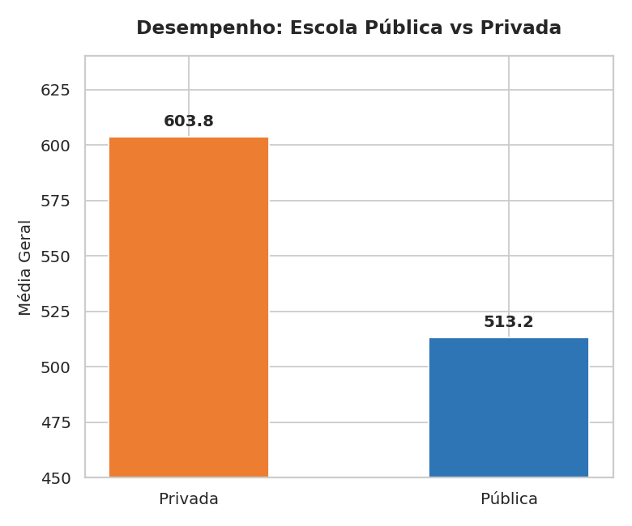
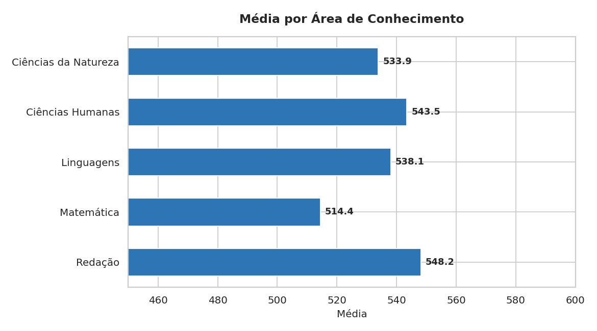
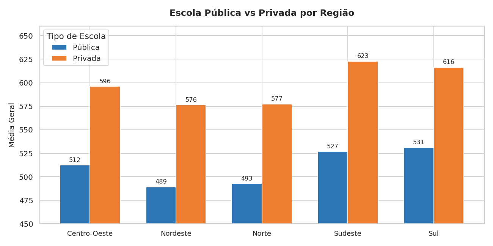

# 📊 Análise de Desempenho no ENEM por Região e Tipo de Escola

Projeto de análise exploratória de dados (EDA) investigando padrões de desempenho no ENEM com foco em desigualdades regionais e diferenças entre escolas públicas e privadas.

---

## 🎯 Objetivo

Identificar padrões e disparidades no desempenho de estudantes no ENEM considerando:
- Região geográfica
- Tipo de escola (pública vs privada)
- Área de conhecimento

---

## 🗂️ Estrutura do Projeto

```
📁 portfolio-enem/
├── gerar_dados.py        # Geração do dataset simulado
├── analise_enem.py       # Análise exploratória e geração de gráficos
├── dados_enem_simulado.csv
├── graficos/
│   ├── 1_media_por_regiao.png
│   ├── 2_publica_vs_privada.png
│   ├── 3_media_por_area.png
│   └── 4_regiao_x_escola.png
└── README.md
```

---

## 🔍 Principais Análises

### 1. Média Geral por Região


Sudeste e Sul lideram o desempenho médio, enquanto Norte e Nordeste apresentam as menores médias — refletindo desigualdades históricas de acesso à educação de qualidade.

---

### 2. Escola Pública vs Privada


Estudantes de escolas privadas apresentam média ~90 pontos acima dos de escolas públicas, diferença consistente em todas as regiões analisadas.

---

### 3. Desempenho por Área de Conhecimento


Matemática é a área com menor desempenho médio em todas as regiões, enquanto Redação e Ciências Humanas apresentam os melhores resultados.

---

### 4. Pública vs Privada por Região


A disparidade entre escolas públicas e privadas é presente em todas as regiões, com maior gap no Sudeste e menor gap no Norte.

---

## 🛠️ Tecnologias Utilizadas

| Ferramenta | Uso |
|---|---|
| Python 3 | Linguagem principal |
| pandas | Manipulação e análise de dados |
| matplotlib | Geração de gráficos |
| seaborn | Estilização dos gráficos |

---

## ▶️ Como Executar

```bash
# Clone o repositório
git clone https://github.com/seu-usuario/portfolio-enem.git
cd portfolio-enem

# Instale as dependências
pip install pandas matplotlib seaborn

# Gere o dataset
python gerar_dados.py

# Execute a análise
python analise_enem.py
```

Os gráficos serão salvos automaticamente na pasta `graficos/`.

---

## 📌 Sobre os Dados

Os dados utilizados são **simulados** com estrutura inspirada nos microdados oficiais do ENEM (INEP), mantendo distribuições e proporções próximas à realidade brasileira. Para análises com dados reais, os microdados estão disponíveis em [dados.gov.br](https://dados.gov.br).

---

## 👩‍💻 Autora

**Gabriela da Matta Matos** — Analista de Dados  
[LinkedIn]([https://linkedin.com/](https://www.linkedin.com/in/gabriela-matos-53abb417b/)) · matos.gabrielaa@gmail.com
